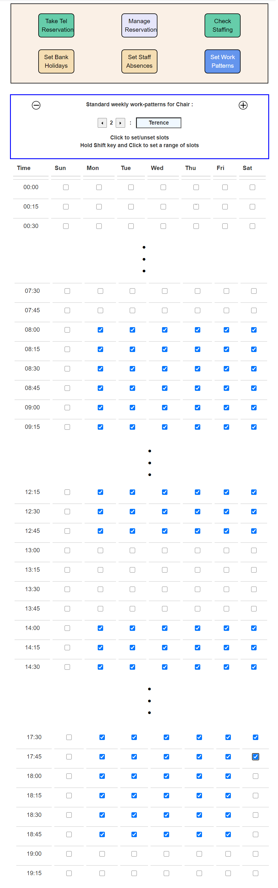

The image below shows the online booking screen. The on-line booker is required to enter an email address for identification purposes and is then is able to select any available appointment time. The screen initially shows days with free appointments for a three-month period. Selecting a day reveals a detailed screen showing the free appointent slots on that day. Selecting a slot initiates a payment process. Successful conclusion results in the despatch of a confirmation receipt to the bookers email address.

 

The image below shows the configuration view of the online booking screen. This is initiated by calling booker.html with "mode" and "version" parameters - best achieved by interfacing it to a signon screen. Once entered, the screen offers six management options. The image below has been produced via booker.html?mode=viewer?ver=1.0 and displays the shop-managers view of the appointment book. This permits selection of a day/slot combination and displays the bookings that have been created for that slot as a popup overlay.

The "Take Tel Booking" button allows the manager to take an unpaid telephone booking. The Change Booking button allows a booking to be switched to a different slot
  

 

The remaining buttons provide for configuration of the appointment book. "Set Bank Holidays" and "Set Staff Holidays" allow complete days to be blocked out and their operation is perfectly intuitive. The "Set Working Patterns" button is used to set the working patterns of each individual member of staff and is rather more complex

"Working patterns" are currently configured by the hour and are set by "chair number" for a full week. Setting working patterns for a "chair" is achieved by checking the boxes for day/hour combinations. Whole days can be toggled on an off by checking the box at the head of the column

 This is a tedious operation and, if there is a large number of staff and they all work roughly similar hours, it may be be easier to set one pattern and then use the Mysql editor to clone the ecommerce_work_patterns record for that record in order to create records for the rest of the set. Likewise you'd use the editor to set the names of the chair "owners". Once the records are initialised, the "working patterns" button can then be used to fine-tune the individual records

A moments though will lead you to realise that changing work patterns after the appointment book has been running for a while may invalidate reservations in the sense that it may no longer be possible to honour reservations made against an earlier version of the patterns since staff are no longer available. This problem will be addressed by future versions of the system

 A screenshot for a sample work-pattern configuration is shown below. This commits "Robert" to work Monday to Saturday between 8.00am and 7.00pm except for an hour off at 1pm each day and Saturday when he leaves at 6.00pm. Lucky Robert!

 

